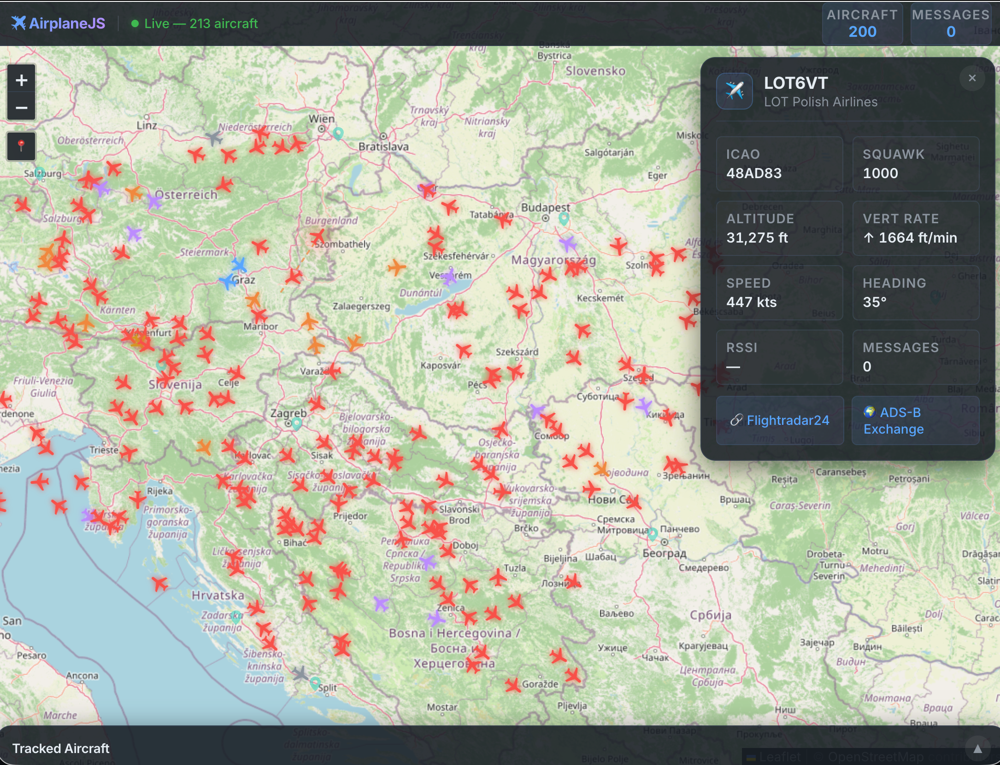

# AirplaneJS

📡 ✈️ A TypeScript app that reads ADS-B data from [dump1090-fa](https://github.com/flightaware/dump1090) and plots aircraft in real time on a map in your browser.



## Prerequisites

### dump1090-fa

This software requires a running instance of [dump1090-fa](https://github.com/flightaware/dump1090) (FlightAware's fork of dump1090). dump1090-fa handles the RTL-SDR hardware and decodes the ADS-B signals — AirplaneJS connects to its **SBS/BaseStation TCP feed** (port `30003` by default).

#### Installing dump1090-fa

**Raspberry Pi / Debian:**

```bash
sudo bash -c "$(wget -O - https://www.flightaware.com/adsb/piaware/install)"
# or
sudo apt-get install dump1090-fa
```

**macOS (Homebrew):**

```bash
brew install dump1090-mutability
```

**From source:**

```bash
git clone https://github.com/flightaware/dump1090.git
cd dump1090
make
./dump1090 --net --net-sbs-port 30003 --interactive
```

Make sure dump1090-fa is running with SBS/BaseStation output enabled (the `--net` family of flags). AirplaneJS reads the feed over TCP.

### Hardware

You'll need an [RTL-SDR USB dongle with an RTL2832U chip](https://www.rtl-sdr.com/buy-rtl-sdr-dvb-t-dongles/) connected to the machine running dump1090-fa.

### Software

- [Bun](https://bun.sh) (or Node.js 18+) for running the server
- [dump1090-fa](https://github.com/flightaware/dump1090) running and accessible

## Usage

### Quick start

1. Make sure dump1090-fa is running with network output:
   ```bash
   dump1090-fa --net
   ```

2. Install dependencies (also fetches the OpenFlights data files) and run:
   ```bash
   bun install
   bun run dev
   ```

Your browser should automatically open to the URL logged on startup.

### Production

```bash
bun run build   # vite build (client) + tsc (server) → dist/
bun start       # NODE_ENV=production bun dist/server/main.js --no-browser
```

### Options

| Option | Alias | Default | Description |
|---|---|---|---|
| `--help` | `-h` | | Show help |
| `--version` | `-v` | | Output version |
| `--dump1090-host` | `-H` | `adsb.local` | dump1090 SBS host |
| `--dump1090-port` | `-P` | `30003` | dump1090 SBS/BaseStation port |
| `--port` | `-p` | auto (free port) | HTTP server port |
| `--no-browser` | | | Don't open browser |

### Examples

```bash
# Connect to dump1090 on a Raspberry Pi
bun dist/server/main.js --dump1090-host 192.168.1.100

# Custom ports, no browser
bun dist/server/main.js --dump1090-host piaware.local --dump1090-port 30003 --port 8000 --no-browser
```

## Scripts

| Script | Command |
|---|---|
| `dev` | `bun --watch src/server/main.ts` |
| `build` | `bunx vite build && bunx tsc -p tsconfig.server.json` |
| `start` | `NODE_ENV=production bun dist/server/main.js --no-browser` |
| `typecheck` | `bunx tsc` on both configs (`--noEmit`) |
| `test` | `npm run typecheck` |
| `data` | downloads the OpenFlights CSVs |

## Features

- 🗺️ **Live map** with dark theme (OpenStreetMap tiles)
- ✈️ **Aircraft markers** colored by altitude, rotated by heading
- 📊 **Aircraft list** with real-time updates
- 📡 **Detailed info panel** showing altitude, speed, heading, squawk, RSSI, vertical rate
- 🔗 **Direct links** to Flightradar24 and ADS-B Exchange
- 🚨 **Emergency squawk detection** (7500, 7600, 7700)
- 🌐 **No API keys required** — uses free OpenStreetMap tiles

## Architecture

```
RTL-SDR USB → dump1090-fa (decoding) → SBS/BaseStation TCP (30003) → AirplaneJS server → browser (Leaflet)
```

The server ingests the SBS feed (`src/server/dump1090.ts`), stores live aircraft in memory (`src/server/store.ts`), and serves the data plus a Vite-bundled Leaflet client. See [TYPESCRIPT.md](TYPESCRIPT.md) for the full module breakdown.

## Project structure

```
src/
  shared/types.ts     shared domain types
  server/             Node server (HTTP router, dump1090 client, store)
  client/             Leaflet browser app
index.html            Vite entry
vite.config.ts
tsconfig.{base,server,client}.json
```

## Migrating from v1

Version 2.0 replaces direct RTL-SDR access with dump1090-fa integration. This means:

- ✅ No more native compilation issues
- ✅ No Python 2 dependency
- ✅ Works with modern Node.js / Bun
- ✅ Better decoding (dump1090-fa is the gold standard)
- ✅ Free map tiles (no Google Maps API key needed)

## License

MIT
